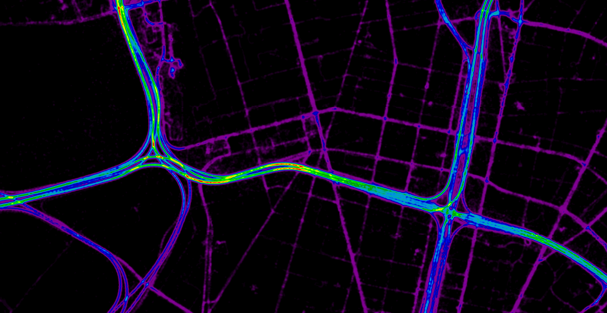
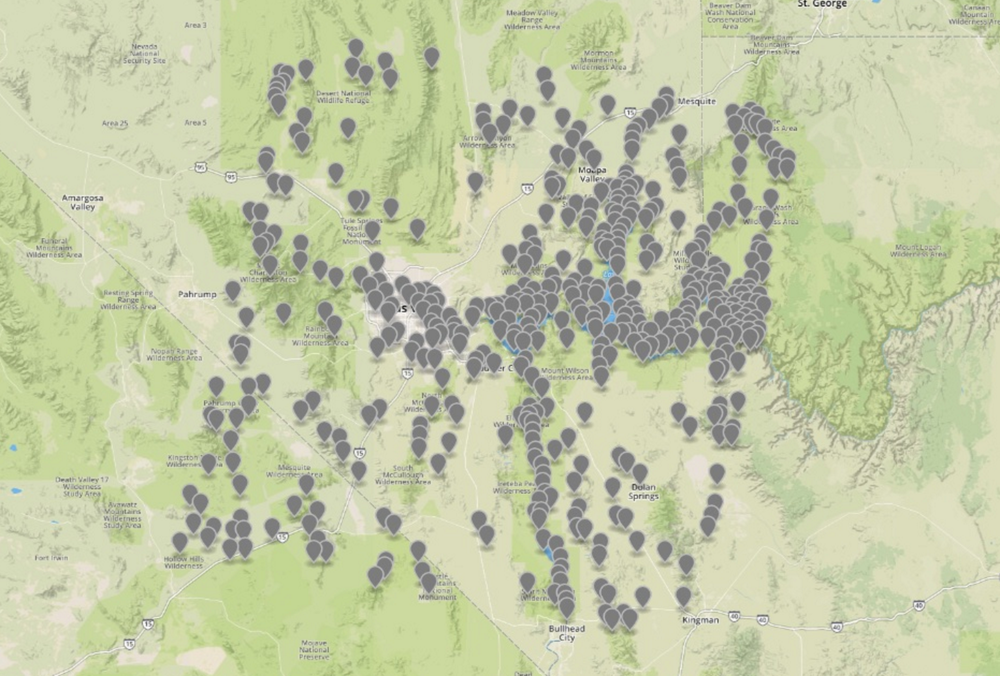

% Wat
% Damon Burgett
% September 16, 2016

# 
# Why?
# We need to QC our imagery at a very large scale
# 
# How to identify this automatically?
#  Telemetry density data
# 
# 
# A [Map](https://api.tiles.mapbox.com/v4/dnomadb.density-test/page.html?access_token=pk.eyJ1IjoibWF0dCIsImEiOiJTUHZkajU0In0.oB-OGTMFtpkga8vC48HjIg)
# 
# 
# 
# 

